<div align="center">

<picture>
  <source media="(prefers-color-scheme: dark)" srcset="frontend/public/logo-dark.svg" />
  
</picture>

# PrintStash

### Self-hosted asset management for people who 3D print more things than they can remember.

PrintStash is a local-first web app for STL, 3MF, OBJ, and G-code libraries.
Upload manually or let OrcaSlicer push new G-code after every slice, then find
files by model name, collection, tags, slicer metadata, material, printer, and
print history.


[](https://github.com/xiao-villamor/PrintStash/releases)
[](https://github.com/xiao-villamor/PrintStash/actions/workflows/ci.yml)
[](https://github.com/xiao-villamor/PrintStash/pkgs/container/printstash-api)
[](./LICENSE)


[**Quick Start**](#quick-start) · [**Features**](#features) · [**Comparison**](#printstash-vs-a-simple-model-vault) · [**Wiki / Docs**](https://xiao-villamor.github.io/PrintStash) · [**Limitations**](#known-limitations--beta-notes) · [**Security**](#security)

</div>

---

## Project Status

PrintStash is an early open-source, self-hosted project. The current release is
usable for local libraries and Moonraker/Klipper workflows, with Docker Compose
as the primary install path. SQLite plus local disk is the default; Postgres and
S3/R2-compatible storage are optional.

Hardware reports, parser fixtures, install notes, docs fixes, and UX feedback
are welcome in
[Discussions](https://github.com/xiao-villamor/PrintStash/discussions) or issues.

## Who Is This For?

PrintStash targets people whose print output has outgrown their memory of it.

If you run Klipper/Moonraker, live status, send-to-print, and imported print
history sit next to the files instead of in a separate tab. OrcaSlicer,
PrusaSlicer, Bambu Studio, and Cura users get every exported G-code captured
with the slicer settings that produced it. On a homelab NAS or mini PC the whole
thing runs locally, with no cloud account or subscription. And once a library of
STLs, 3MFs, STEP files, and G-code has sprawled past the point of recall, it
replaces the "which version actually printed well?" guesswork that otherwise
lives in folder names.

## How Is This Different?

Most tools store *files*. PrintStash stores the printing context around a file
and links it together:

- **Models + G-code as revisions** — source meshes and every sliced G-code live
  on one model, with version history and a recommended/known-good verdict.
- **Slicer metadata, parsed** — layer height, material, nozzle/bed temps,
  estimated time, filament weight, and cost extracted from the G-code itself.
- **Printer presence + live status** — see what's on which printer right now, and
  send a revision straight to it.
- **Real print history** — measured filament and actual duration captured from
  Moonraker when a print finishes, with per-print cost.
- **Search across all of it** — find by model name, collection, tag, material,
  slicer, printer, or print outcome — not just filename.
- **Operations included** — full backup/restore, recycle bin recovery, multiple
  users, and collection-level access control are part of the vault instead of
  bolted-on scripts.

It runs on your own hardware. No cloud account, no subscription, no telemetry.

## PrintStash vs. a Simple Model Vault

A simple model vault is a folder browser with thumbnails: upload a mesh, search
by filename or tag. That holds up until you come back months later and the slicer
settings, the version that printed cleanly, and the print history are all gone.

PrintStash keeps the print as the unit of record, not the STL. The difference,
by capability:

| Capability | Simple model vault | PrintStash |
| --- | --- | --- |
| Source models | Stores STL/3MF/OBJ files | Stores source files plus every G-code revision under one model |
| Storage model | Copies files into its own store | Vault store **or** index a server folder / NAS in place (shared volumes), synced on a schedule and watched in real time |
| Preview | Thumbnail or mesh preview | Browser 3D preview and G-code toolpath preview |
| Slicer data | Usually manual notes | Extracts useful G-code metadata: slicer, printer profile, material, layer height, nozzle, infill, temperatures, estimated time, filament length/weight/cost |
| Versions | Duplicate filenames or folders | Revision labels, notes, status, compare view, and recommended/known-good marker |
| Printer context | Separate from library | Moonraker/Klipper status, send-to-print, job tracking, and remote printer file inventory matched back to vault models |
| Recovery | Manual file restore | Full backup/restore plus recycle bin with retention and purge controls |
| Teams/families | One shared login or no auth | Multiple users, named API keys, admin tools, and collection-level RBAC |
| Personalization | Fixed UI | Custom model-card metrics and model-detail metadata visibility |

## Features

**Ingest and organize**
- STL, 3MF, OBJ, STEP/STP, and G-code upload from the browser.
- URL imports and `.zip` archives, with per-file selection on extraction.
- An OrcaSlicer post-processing hook pushes exported G-code automatically: it
  logs in with username + API key, then uploads under a JWT Bearer token.
- Content-hash dedup groups files into logical models and keeps version history
  in one place rather than scattered across folders.
- Nested collections, flat tags, search, filters, thumbnails, grid/list views,
  sorting, breadcrumbs, and drag-and-drop between collections.

**Shared volumes (mirror a folder or NAS)**
- Point PrintStash at a folder on the server or a NAS and it indexes files **in
  place** — no copying, no second source of truth; only thumbnails and metadata
  are stored in the vault.
- Two-way sync: scans pick up added, removed, and edited files, and web uploads
  and revisions write back into the folder (never overwriting existing bytes).
- Keep it current with a per-volume schedule (presets or custom cron), manual
  "Scan now", and optional real-time watching of local folders.
- Network folders (NFS/SMB) can't deliver filesystem events, so watching
  auto-detects the filesystem and falls back to the schedule — with a per-volume
  override. An unmounted share can never trigger a mass delete.

**Preview and inspect**
- A browser 3D viewer for source meshes — solid, X-ray, and wireframe modes,
  plus build-plate grid, fit-to-view, zoom, reset, and screenshot.
- G-code toolpath preview with layer navigation, travel visibility, and bed
  overlays derived from printer profiles.
- One model detail page covers the source files, recommended G-code, slicer
  settings, mesh metadata, and print history.
- Slicer metadata is parsed out of common OrcaSlicer, PrusaSlicer, Bambu Studio,
  Cura, and Klipper-style output: slicer/version, printer profile, nozzle, layer
  height, infill, material, filament brand/type, temperatures, estimated time,
  and filament length/weight/cost.
- Mesh metadata where the file carries it — bounding box, volume, triangle count.

**G-code revisions**
- Multiple G-code revisions per model, each with a label, notes, and outcome
  status.
- Statuses are `known_good`, `needs_test`, `failed`, or `archived`; exactly one
  revision is recommended at a time.
- A side-by-side compare view diffs two revisions on slicer, material, and print
  metadata.
- The first successful print auto-marks a revision known-good.

**Printer workflows**
- Moonraker/Klipper printers with live WebSocket status and send-to-print.
- Remote file inventory sync, matched back to vault files where the filenames
  line up.
- Vault-initiated jobs track through upload/start/status states, and the UI shows
  which printer already holds a model's G-code or can start a supported remote
  file.
- Print history import pulls measured filament use, actual duration, and
  per-print cost from Moonraker.
- Provider diagnostics cover capabilities, configuration, and connectivity.
- Bambu LAN status and pause/resume/cancel, in beta.

**Users, access, and administration**
- A first-run setup wizard creates the first admin account. There is no default
  password.
- JWT login with refresh/logout, admin user management, and named API keys for
  scripts and slicer hooks.
- Collection-level RBAC shares parts of a library at view/edit/admin levels.
- Audit logs record who changed what.
- A recycle bin keeps soft-deleted models restorable until retention expires,
  with manual restore, purge-expired, and permanent-delete.

**Backups, portability, and customization**
- Full backup/restore of the database plus stored files and thumbnails.
- Backups can mirror to S3/R2-compatible storage, independent of where vault
  files live.
- Metadata export to JSON or CSV for analysis, migration planning, or audits.
- Model-card metrics and the metadata fields shown on detail pages are
  configurable.
- Local disk by default, with optional S3/R2 object storage and Postgres, plus
  upload limits, trash retention, and backup retention.
- Health checks report database, storage, backup, and printer-provider readiness.

## Quick Start

> [!WARNING]
> **Run PrintStash only on a trusted self-hosted network.** Do not expose it
> directly to the public internet. If you need remote access, put it behind a
> reverse proxy with TLS and your own authentication, and change
> `VAULT_JWT_SECRET` from its placeholder default first.
> See [Security](#security).

Requirements: Docker and Docker Compose.

```bash
git clone https://github.com/xiao-villamor/PrintStash.git
cd PrintStash

cp .env.example .env
# Edit .env and set a strong, random value for VAULT_JWT_SECRET,
# e.g. `openssl rand -hex 32`.

docker compose up -d --build
```

Open:

| Service | URL |
| --- | --- |
| Web UI | http://localhost:3000 |
| API docs | http://localhost:8000/docs |
| Health check | http://localhost:8000/api/v1/health |

On first launch, the web UI creates the first admin account. There is no default
username or password.

## Screenshots

### Library & organization

| Asset grid | Search | Collections & filters |
| --- | --- | --- |
| 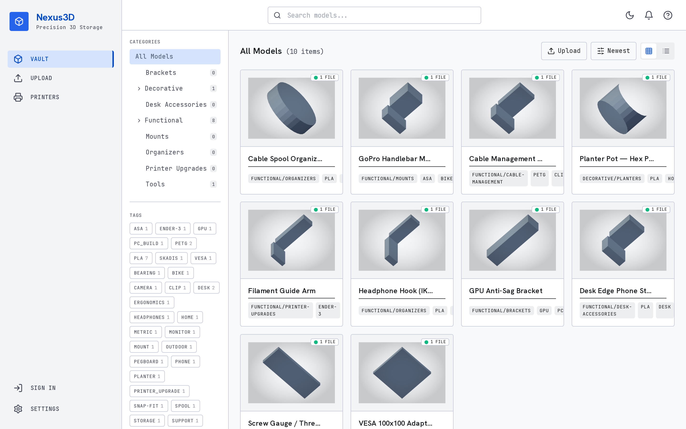 | 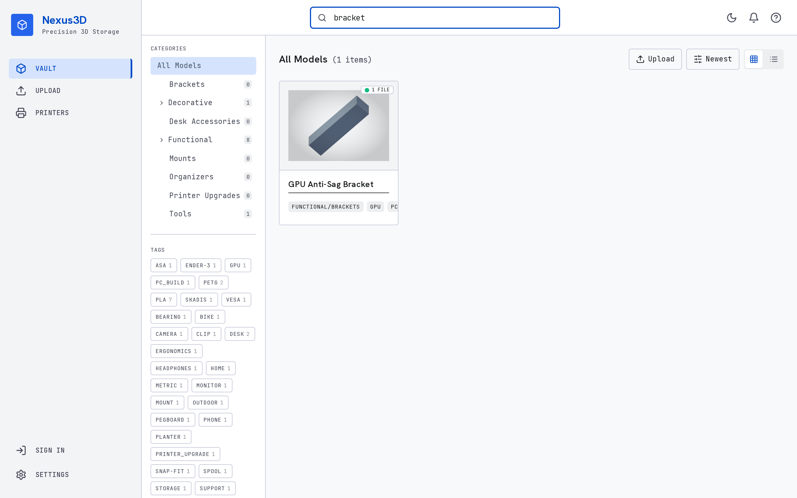 | 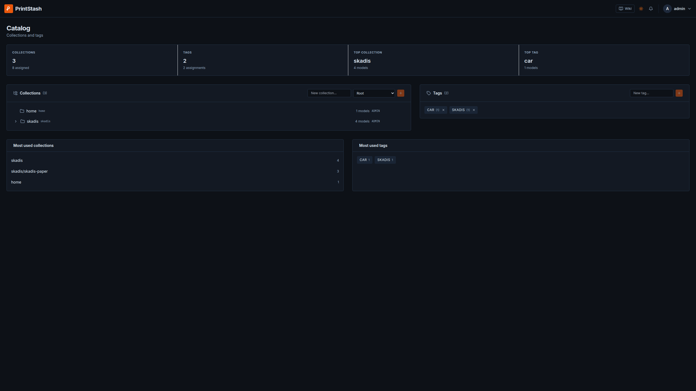 |

### Model detail

| Overview | 3D viewer | G-code toolpaths |
| --- | --- | --- |
| 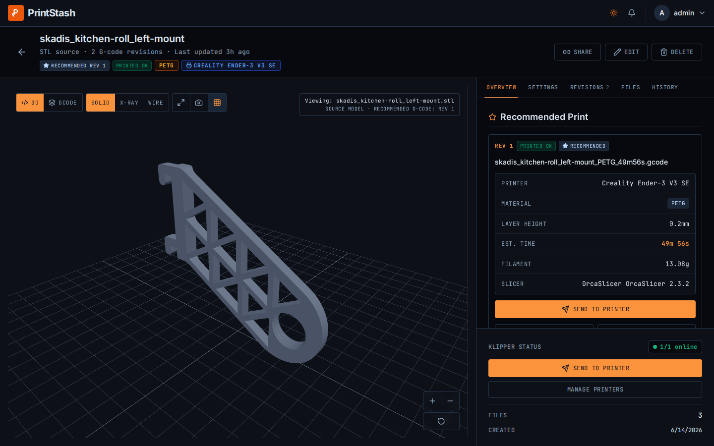 | 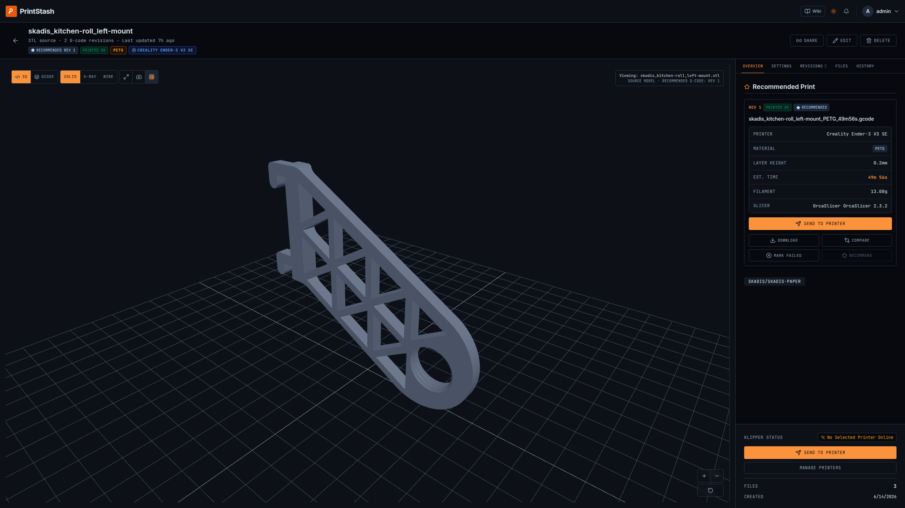 | 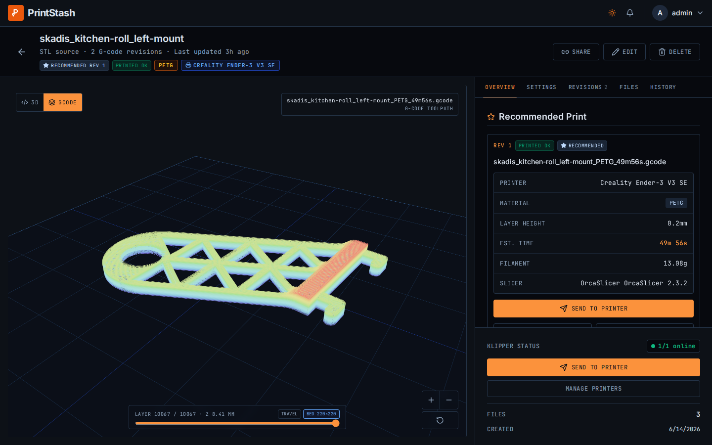 |

### Revisions & printers

| G-code revisions | Live printer status | Printer files | Printer diagnostics |
| --- | --- | --- | --- |
| 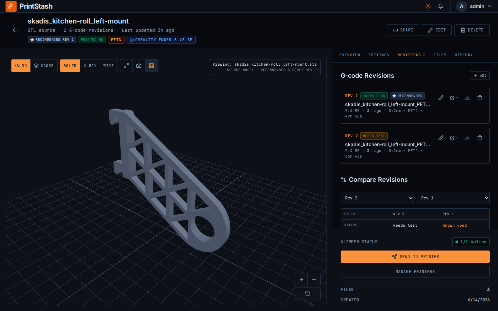 | 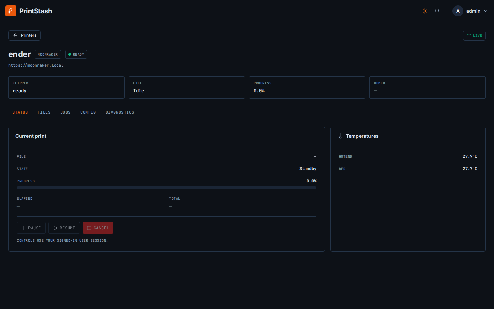 | 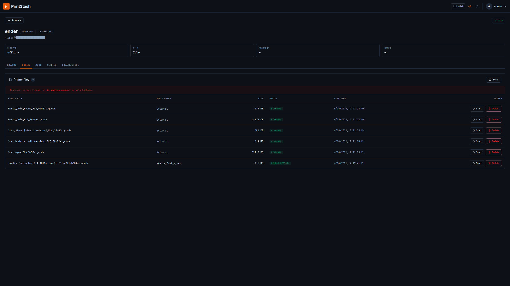 | 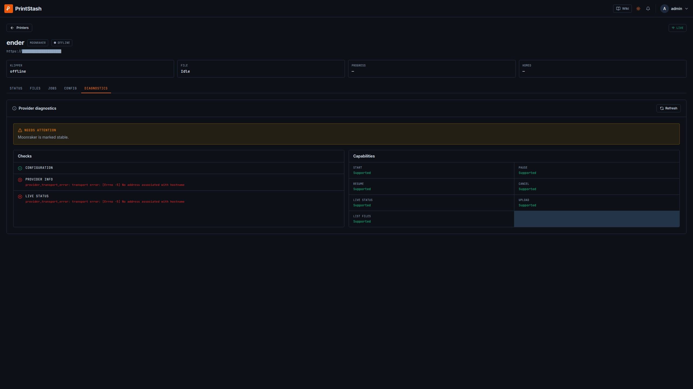 |

### Settings & administration

| Overview | Users & access | Storage | Design |
| --- | --- | --- | --- |
| 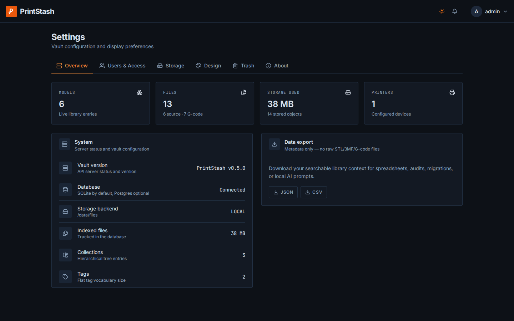 | 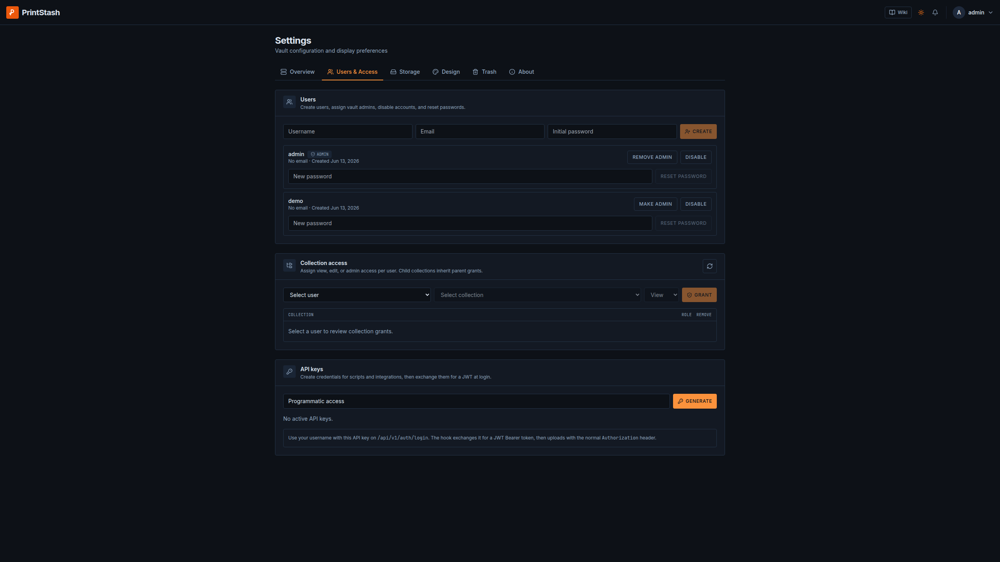 | 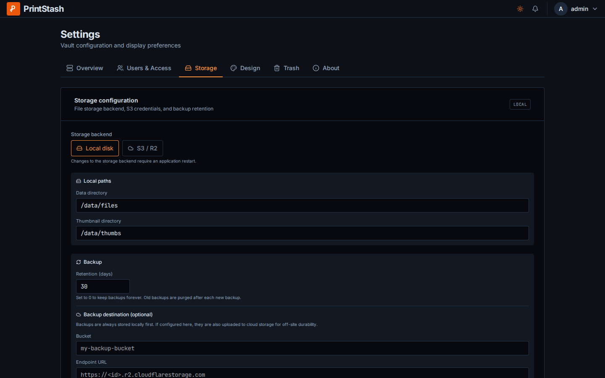 | 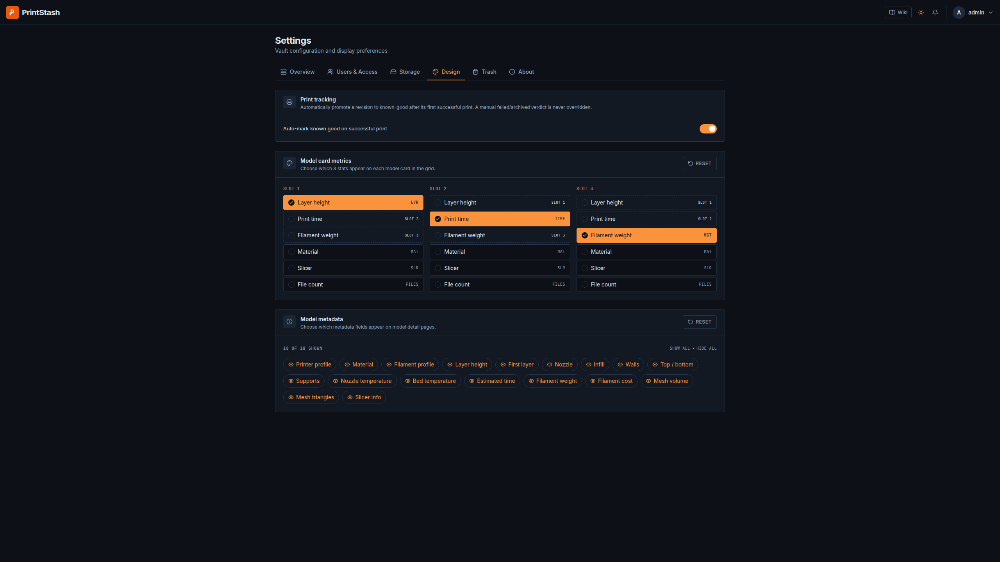 |

### In motion

| Compare G-code revisions | Filter by tag |
| --- | --- |
| 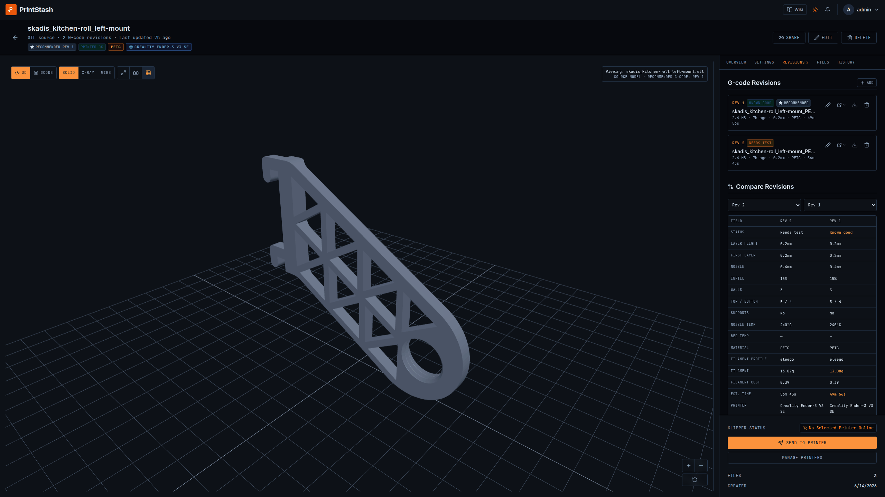 | 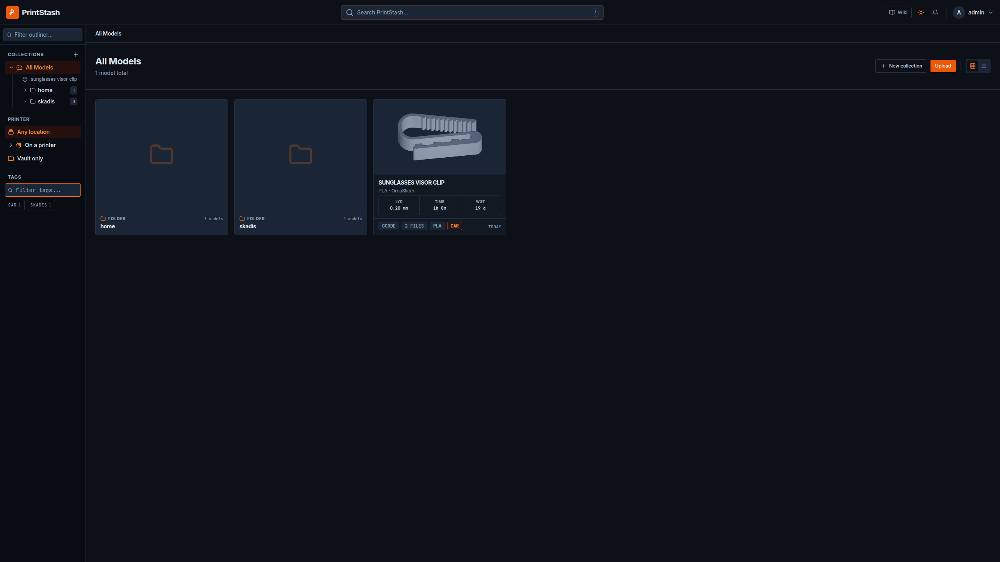 |

## Known Limitations & Beta Notes

PrintStash is a **beta** self-hosted release. It is useful today, but it is
deliberately not a full manufacturing platform. Set expectations accordingly:

- **Bambu LAN is beta** and limited to local status plus pause/resume/cancel.
  Upload, send-to-print, remote file inventory, and remote-file start are
  **not** implemented for Bambu yet, issues are wellcome. Moonraker/Klipper is the fully supported
  provider.
- **Hardware coverage is still thin.** Provider behavior needs more real-world
  validation across printers, firmware versions, and network/auth setups.
  Reports are very welcome.
- **Slicer metadata parsing varies.** Extraction is best for common OrcaSlicer,
  PrusaSlicer, Bambu Studio, Cura, and Klipper output; missing fields are
  expected — please report them with safe sample files.
- **The G-code viewer is a visualization aid**, not a slicer-grade simulator. It
  does not validate firmware macros, acceleration, pressure advance, or safety.
- **Not for direct public exposure.** It is designed for trusted self-hosted
  networks (see [Security](#security)).

Full detail — including non-goals — lives in
[docs/known-limitations.md](./docs/known-limitations.md).

## Contributing

Bug reports, hardware notes, docs fixes, and small PRs are welcome. Start with
[CONTRIBUTING.md](./CONTRIBUTING.md). Good first contributions include printer
reports, parser fixtures, install notes, and small UI workflow improvements.

Not sure where to start? See
[community starter issues](./docs/community-starter-issues.md) or open a
discussion.

## Security

Read [SECURITY.md](./SECURITY.md) before reporting vulnerabilities.
PrintStash is designed for trusted self-hosted networks; do not expose it
directly to the public internet without a reverse proxy, TLS, and your own
access controls.

## License

PrintStash is licensed under the [GNU AGPL-3.0](./LICENSE).
