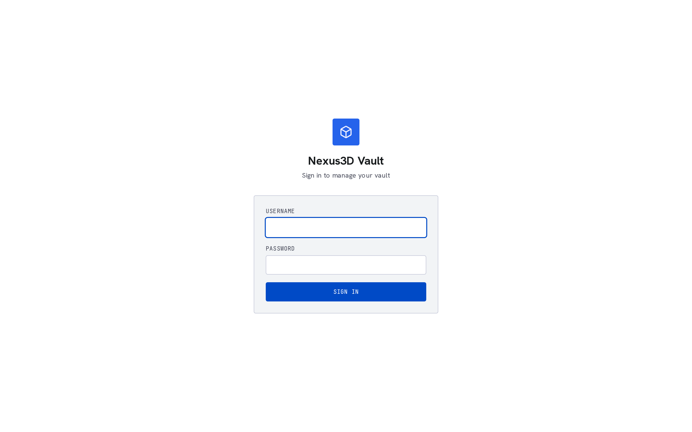

# PrintStash

Self-hosted asset library for 3D printing. Upload STLs, 3MFs, and G-code
files. The vault keeps them organized, deduplicated, and searchable — with a
web UI and an in-browser 3D viewer.

## What it does

Drops a file in, pulls out what it can find:

- **Slicer settings** from G-code — filament type, layer height, nozzle diameter,
  infill, estimated print time, material brand and cost
- **Geometry** from STLs and 3MFs — bounding box, volume, triangle count
- **Thumbnails** rendered from the mesh (software rasteriser, no GPU needed)
- **Deduplication** by SHA-256 content hash so re-uploads don't create duplicates
- **Version tracking** — slice the same model again with different settings and
  both gcode versions live under the same model entry
- **Categories** (hierarchical: Functional/Brackets, Decorative/Planters, etc.)
  and **flat tags** (PLA, PETG, desk, workshop...)
- **Search** across names, tags, and categories
- **3D viewer** in the browser for STL files

Everything has a REST API. The web UI is a consumer of the same API any script
or integration can call.

## What it looks like





## Quick start

```bash
cp .env.example .env
# open .env, pick an API key, set a real JWT secret
docker compose up -d
```

| Service  | URL                          |
| -------- | ---------------------------- |
| Web UI   | http://localhost:3000        |
| API docs | http://localhost:8000/docs   |
| Health   | http://localhost:8000/api/v1/health |

On first startup the web UI will open a setup wizard — pick an admin username
and password, confirm where you want files stored. There's no default account.

Test it from the command line:

```bash
curl -F "file=@some_print.gcode" \
     -F "model_name=Desk Bracket" \
     -F "category=Functional/Brackets" \
     -H "X-API-Key: changeme" \
     http://localhost:8000/api/v1/ingest/orca
```

## Planned

- OrcaSlicer post-processing hook — auto-upload when you slice, no manual steps
- Moonraker/Klipper integration — browse the vault, pick a file, send it to a
  printer, live status and job history
- Multi-user auth and optional cloud backup (opt-in, local-first always)

## Architecture

```
Browser ──► Next.js (port 3000) ──► FastAPI (port 8000) ──► SQLite
```

Frontend and API run in Docker. Files go to named volumes so data survives
rebuilds. The backend has an optional Rust module for faster thumbnail rendering
and G-code scanning — falls back to pure Python if Rust isn't available.

## What it is not

- Not a slicer. Bring your own sliced files.
- Not a cloud service. Runs on your hardware. Cloud stuff will be opt-in if it
  ever happens.
- Not a print queue manager. You can send jobs to Moonraker from the UI (planned),
  but the queue lives on your printer firmware.

## Development

Python 3.11+ and Node.js 20+.

```bash
# Backend
cd backend
uv sync
VAULT_API_KEY=devkey VAULT_DB_URL=sqlite:///./dev.sqlite \
VAULT_DATA_DIR=./_data/files VAULT_THUMB_DIR=./_data/thumbs \
uv run uvicorn app.main:app --reload

# Frontend
cd frontend
pnpm install
pnpm dev
```

Tests:

```bash
cd backend
uv run pytest tests
```

## License

AGPL-3.0. If you improve it, share back. If you're just running it on your
server for your own prints, the license doesn't get in your way.
