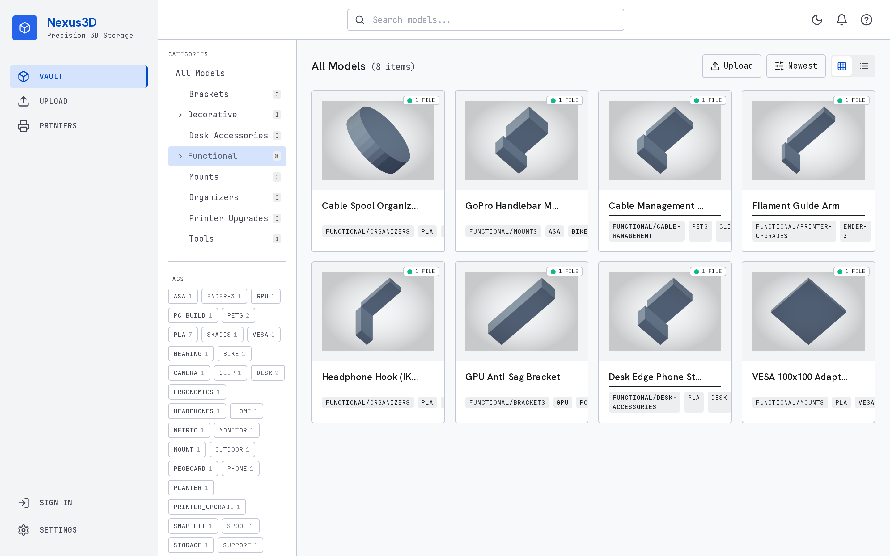
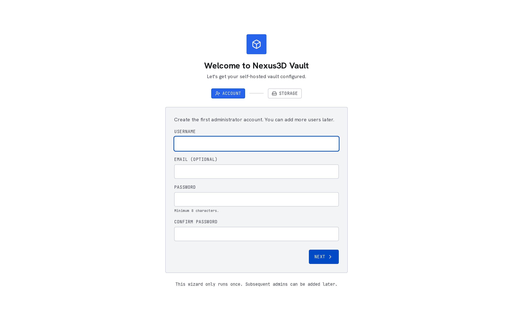

# PrintStash

Self-hosted asset management for people who 3D print more things than they can
remember.

PrintStash is a local web app that keeps track of your STL, 3MF, and G-code files.
It is meant for the very ordinary problem of "I sliced this bracket six months
ago, which file was the good one?" Upload files manually or let OrcaSlicer push
new G-code after every slice, then search by model name, category, tags, slicer
metadata, material, printer, and print history.


[](./LICENSE)


## Why this exists

Most 3D printing workflows are good at producing files and bad at remembering
them. Slicers know the settings. Printers know what is running now. File shares
know where blobs live. None of them make it easy to answer:

- Which version of this part did I actually print?
- What filament and layer height did I use?
- Did I already slice this for the printer in the garage?
- Where did that G-code go after OrcaSlicer exported it?

PrintStash tries to be the small, boring library in the middle. It stores the files,
extracts the metadata, keeps versions together, and gives you an API/UI you can
run at home.

## Current State

This is the 1.0 stable self-hosted release. Docker Compose is the main install
path. SQLite and local disk are the default. Postgres, S3-compatible storage,
and printer-farm features exist for bigger setups, but stay optional.

What works today:

- File ingestion for STL, 3MF, and G-code
- OrcaSlicer post-processing hook with no Python dependencies
- Metadata extraction from G-code, including slicer settings and filament info
- Content-hash deduplication and model version history
- G-code revision notes, outcome labels, recommended version, and metadata compare
- Categories, tags, search, thumbnails, and an in-browser STL viewer
- First-run setup wizard, API key auth for scripts, JWT login for the UI
- Moonraker/Klipper printer integration with live status and send-to-print
- Beta Bambu LAN support for status and basic print controls
- Optional Postgres, S3/R2 storage, backup archives, and audit logs

Known rough spots:

- Bambu LAN upload/send parity is not done yet; Bambu support is beta and
  status/control-only in 1.0
- Printer integrations need more real-world hardware testing
- The UI is functional, but workflow polish is still in progress

## Quick Start

Requirements: Docker and Docker Compose.

```bash
git clone https://github.com/xiao-villamor/PrintStash.git
cd PrintStash

cp .env.example .env
# Edit .env and change VAULT_API_KEY and VAULT_JWT_SECRET.

docker compose up -d --build
```

Open:

| Service | URL |
| --- | --- |
| Web UI | http://localhost:3000 |
| API docs | http://localhost:8000/docs |
| Health check | http://localhost:8000/api/v1/health |

On first launch, the web UI walks you through creating the first admin account.
There is no default username or password.

Tagged releases publish Docker images to GitHub Container Registry:

| Image | Purpose |
| --- | --- |
| `ghcr.io/xiao-villamor/printstash-api:<version>` | FastAPI backend |
| `ghcr.io/xiao-villamor/printstash-frontend:<version>` | Next.js frontend |

The checked-in Compose file builds locally by default so contributors can run
from source. Self-hosted release installs can pin the GHCR images in a small
Compose override.

## OrcaSlicer Hook

The hook is intentionally boring: one Python file, stdlib only, exits `0` even if
the vault is offline so it never breaks a slice/export.

```bash
# OrcaSlicer -> Print Settings -> Advanced -> Post-processing Scripts
/usr/bin/python3 /path/to/PrintStash/scripts/nexus3d_orca_push.py \
  --url http://your-printstash-host:8000 \
  --api-key YOUR_API_KEY \
  --category "Functional/Brackets"
```

After that, exported G-code is pushed into the vault automatically.

## Screenshots

| Asset grid | Model detail | 3D viewer |
| --- | --- | --- |
|  |  |  |

| Search | Categories | Setup |
| --- | --- | --- |
|  |  |  |

## API

The frontend uses the same REST API that scripts and third-party tools can use.
Swagger docs are available at `/docs`.

Common endpoints:

| Method | Endpoint | Purpose |
| --- | --- | --- |
| `POST` | `/api/v1/ingest/orca` | Upload a file from OrcaSlicer or curl |
| `GET` | `/api/v1/models` | List and search models |
| `GET` | `/api/v1/models/{id}` | Read one model with files and metadata |
| `PATCH` | `/api/v1/models/{id}` | Update name, description, category, tags |
| `PATCH` | `/api/v1/models/{id}/files/{file_id}/revision` | Update G-code revision status, notes, recommended marker |
| `GET` | `/api/v1/files/{id}/raw` | Download a stored file |
| `GET` | `/api/v1/printers` | List registered printers |
| `POST` | `/api/v1/printers/{id}/send` | Send vault G-code to a printer |
| `GET` | `/api/v1/printers/{id}/status` | Read printer status |
| `WS` | `/api/v1/printers/{id}/ws` | Live printer status stream |

Example upload:

```bash
curl -F "file=@my_print.gcode" \
  -F "model_name=Desk Bracket" \
  -F "category=Functional/Brackets" \
  -H "X-API-Key: YOUR_KEY_HERE" \
  http://localhost:8000/api/v1/ingest/orca
```

## Configuration

Most installs only need to edit secrets in `.env`.

| Variable | Default | Notes |
| --- | --- | --- |
| `VAULT_API_KEY` | `changeme` | Shared key for scripts and write endpoints |
| `VAULT_JWT_SECRET` | `changeme...` | Change before exposing the UI |
| `VAULT_DB_URL` | `sqlite:////data/db/nexus3d.sqlite` | SQLite by default; Postgres optional |
| `VAULT_STORAGE_BACKEND` | `local` | `local` or `s3` |
| `VAULT_DATA_DIR` | `/data/files` | Container path for stored files |
| `VAULT_THUMB_DIR` | `/data/thumbs` | Container path for generated thumbnails |
| `VAULT_MAX_UPLOAD_MB` | `512` | Upload size limit |
| `NEXT_PUBLIC_WS_URL` | `ws://localhost:8000` | Browser-reachable WebSocket URL |

See [.env.example](./.env.example) for the full list, including S3/R2, backups,
MinIO, Postgres, and lifecycle settings.

## Upgrades and Recovery

Read [UPGRADE.md](./UPGRADE.md) before upgrading an existing install. Backup and
restore recovery steps live in [docs/disaster-recovery.md](./docs/disaster-recovery.md).
Release smoke checks are listed in [docs/release-validation.md](./docs/release-validation.md).

## Development

Backend:

```bash
cd backend
uv sync --extra dev

VAULT_API_KEY=devkey \
VAULT_DB_URL=sqlite:///./dev.sqlite \
VAULT_DATA_DIR=./_data/files \
VAULT_THUMB_DIR=./_data/thumbs \
uv run uvicorn app.main:app --reload
```

Frontend:

```bash
cd frontend
pnpm install
pnpm dev
```

Tests and formatting:

```bash
cd backend
uv run pytest tests -v
uv run ruff check app/ tests/
uv run ruff format app/ tests/
```

```bash
cd frontend
pnpm lint
```

## Architecture

PrintStash is a FastAPI backend, a Next.js frontend, and a storage layer that starts
simple on SQLite/local disk.

```text
Browser / scripts / OrcaSlicer
          |
          v
Next.js UI + FastAPI API
          |
          +-- ingestion, metadata extraction, thumbnails
          +-- taxonomy, search, auth, audit, backup
          +-- printer providers: Moonraker stable, Bambu LAN beta
          |
          v
SQLite + local files by default
Postgres + S3/R2 optional
```

The repository keeps most decisions documented in [CONTEXT.md](./CONTEXT.md) and
[docs/adr](./docs/adr).

## Roadmap

The living roadmap is in [docs/roadmap.md](./docs/roadmap.md). The short version:

- Polish G-code revision history and provider maturity, especially Bambu LAN upload/send support
- Harden backup/restore and operational monitoring
- Improve printer-farm workflows and scheduling
- Keep cloud-style features optional, not required for home installs

Roadmap feedback is welcome in
[the roadmap discussion](https://github.com/xiao-villamor/PrintStash/discussions/1).

## Contributing

Bug reports, hardware notes, docs fixes, and small PRs are very welcome. Please
start with [CONTRIBUTING.md](./CONTRIBUTING.md). If you are not sure whether an
idea fits, open a discussion first.

Good first contributions:

- Test a printer/provider combination and report what happens
- Improve install notes for your NAS, mini PC, or homelab setup
- Add parser fixtures for real slicer output
- Tighten UI flows that feel clunky after repeated use

## License

PrintStash is licensed under the [GNU AGPL-3.0](./LICENSE).
